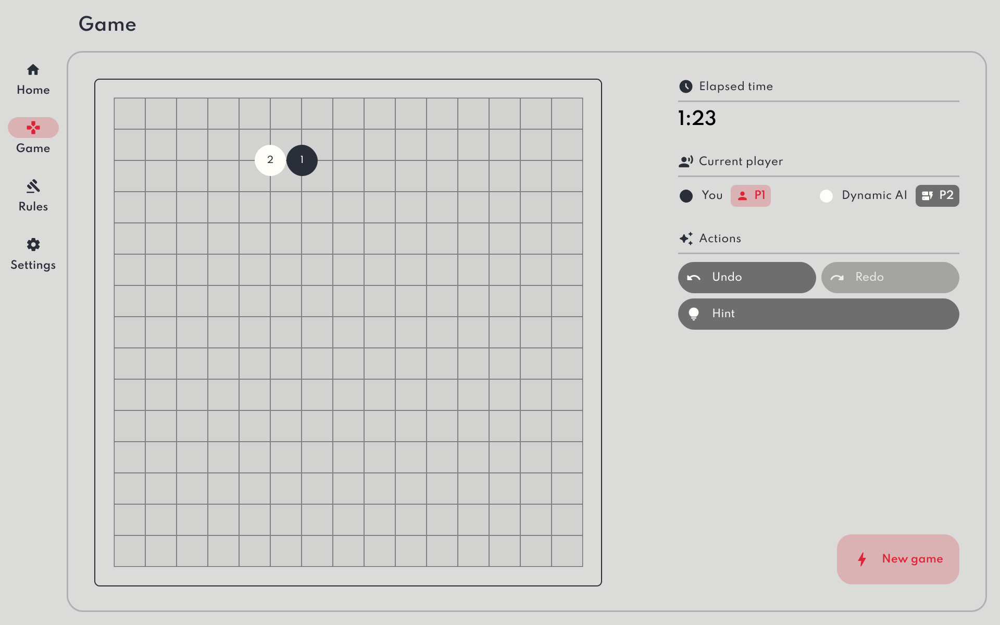

# Gomoku Sensei AI
#### Designing a dynamic game-playing AI.

## Overview
This project was developed as a fourth-year dissertation project for the University of Strathclyde.

## Aims & objectives
The main objective os this project was to adapt an existing game-playing search algorithm (MCTS, Minimax, etc...), in order to develop an AI opponent that is both fun and engaging, yet challenging to play against. The AI will dynamically scale its difficulty according to its opponent's skill level.

Another major component of the project was is the design and implementaiton of a fluid, easy-to-use user interface (UI). The UI is the medium through which users will interact with the game during the evalutation-phase, which means it is vital for the game's UI to be simple and easy, yet at the same time fun to use.

To achieve this goal, a number of task must be completed:

| Objective | Description |
| --- | --- |
| Game choice | Choose a 2-player, fully observable game to develop the AI for. |
| Implementation  | Design and implement a playable version of the game. |
| Killer AI  | Design and implement a well-performing AI using a tree search algorithm. |
| Dynamic AI  | Modify the ‣ to scale its difficulty dynamically according to its opponent's perceived skill level. |
| Evaluation  | Carry out a series of user-based trials to evaluate how well the ‣ scales its difficulty, as well as how engaging it is to play against. |

## Installation
In order to run the game, download or clone the project repository and open the `index.html` file in the root of the project in your browser of choice.

## Acknowledgements
